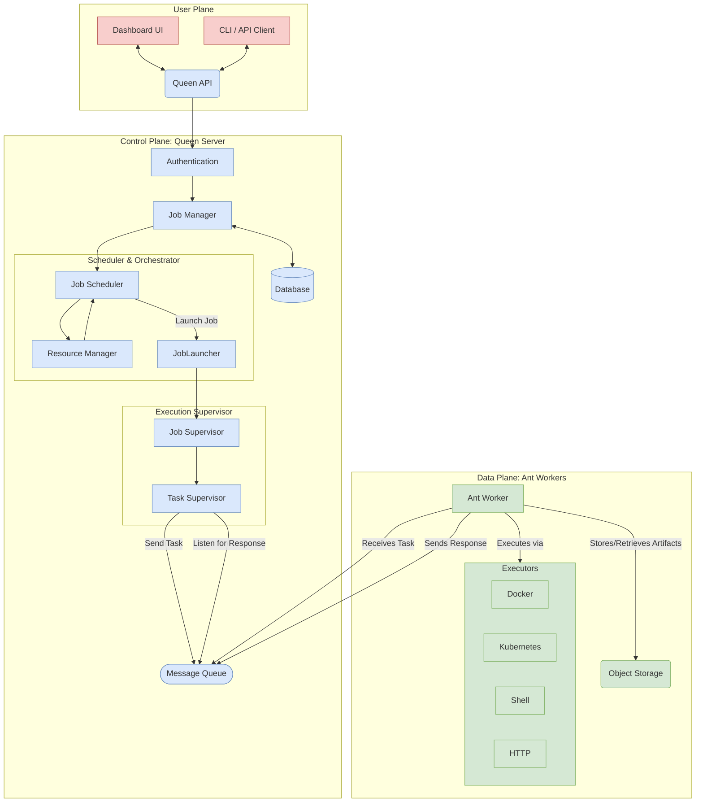

# Introduction to Formicary

Welcome to Formicary! This document provides a high-level overview of the project's architecture, core concepts, and the problems it aims to solve.

## What is Formicary?

Formicary is a distributed orchestration engine designed for developers and operations teams who need to build, schedule, and monitor complex workflows. It excels at automating tasks that involve multiple steps, diverse execution environments, and conditional logic.

At its core, Formicary allows you to define a **Job** as a Directed Acyclic Graph (DAG) of **Tasks**. This model is powerful enough to handle a wide range of use cases:

-   **CI/CD Pipelines:** Compile code, run tests in parallel, build container images, and deploy to different environments.
-   **ETL and Data Pipelines:** Extract data from a source, transform it through a series of steps, and load it into a destination.
-   **Batch Processing:** Run scheduled nightly jobs for reporting, data aggregation, or system maintenance.
-   **Infrastructure Automation:** Orchestrate tasks across different systems using shell scripts or API calls.

## Core Philosophy

Formicary's design is guided by several key principles:

-   **Declarative & Versioned:** Workflows are defined in simple, human-readable YAML files. These definitions are versioned, allowing you to evolve your jobs safely over time.
-   **Distributed & Scalable:** The system is built on a leader-follower architecture. The **Queen** (leader) orchestrates jobs, while multiple **Ants** (followers) execute the work. You can add more Ants to scale out your processing capacity.
-   **Extensible Executors:** Formicary is not tied to a single execution environment. It has native support for running tasks in Docker containers, Kubernetes pods, local shells, or by making HTTP requests. This flexibility allows you to choose the right tool for each task.
-   **Resilience & Fault Tolerance:** With built-in support for automatic retries, timeouts, and conditional failure paths (`allow_failure`), you can build robust workflows that handle transient errors gracefully.

## High-Level Architecture

The system consists of a central **Queen** server and one or more **Ant** workers. They communicate via a message queue (like Redis or Pulsar) and rely on a database for state and an S3-compatible object store for artifacts.

-   **Queen Server:** The central brain of the system.
    -   **API:** Exposes a RESTful API for managing jobs, viewing results, and system administration.
    -   **Job Manager:** Handles the persistence and retrieval of job definitions and requests.
    -   **Resource Manager:** Tracks available Ant workers and their capabilities (e.g., tags, supported methods).
    -   **Job Scheduler:** A leader-elected component that polls for pending jobs and schedules them for execution based on priority and resource availability.
    -   **Job/Task Supervisors:** Active components that manage the lifecycle of a running job, dispatching tasks and reacting to their completion status.

-   **Ant Worker:** A lightweight process that executes tasks.
    -   An Ant registers with the Queen, advertising the `methods` (e.g., `DOCKER`, `KUBERNETES`) and `tags` it supports.
    -   It listens for tasks on the message queue, executes them using the appropriate executor, and sends the results back.
    -   It handles artifact up/download and dependency caching.
