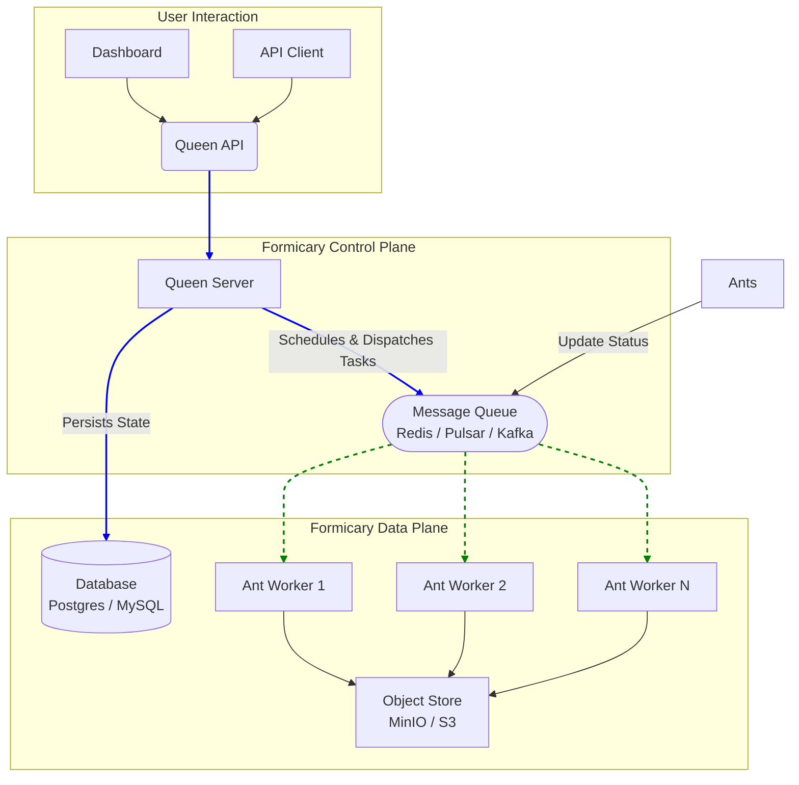

# Architecture

Formicary is designed as a distributed leader-follower system to be scalable, resilient, and extensible. This document describes its high-level architecture, the components involved, and how they interact.

## Architectural Overview

The system is composed of two main services: the **Queen** (the leader/server) and one or more **Ants** (the followers/workers). These services are decoupled and communicate asynchronously via a message queue.

### The Queen (Server)

The Queen is the central orchestration component. It is responsible for all control plane activities. A Queen node is composed of several internal services:

-   **API & UI Controllers:** Provide RESTful APIs for programmatic access and serve the web dashboard for user interaction.
-   **Authentication & Authorization:** Secures the system, managing users, organizations, and access control (RBAC). It integrates with OAuth providers like GitHub and Google.
-   **Job Manager:** A data access layer that handles the CRUD operations for core objects like `JobDefinitions` and `JobRequests`.
-   **Resource Manager:** Tracks the state and availability of all registered Ant workers. It knows which Ants are online, their current load, and what capabilities (tags, methods) they have.
-   **Job Scheduler:** A leader-elected service that continuously polls for `PENDING` job requests. When resources are available (as determined by the Resource Manager), it prepares the job for execution and publishes a "launch" event.
-   **Job Supervisor:** An instance of a supervisor is created for each running job. It orchestrates the job's DAG, calling the Task Supervisor for each step.
-   **Task Supervisor:** Manages the lifecycle of a single task. It sends the task request to a suitable Ant via the message queue and waits for the response.

### The Ant (Worker)

Ants are the followers that perform the actual work. They are stateless and horizontally scalable. An Ant can be a standalone process or run as an embedded component within the Queen server.

-   **Registration:** On startup, an Ant registers with the Queen, advertising its capabilities (e.g., supported `methods` like `DOCKER`, `KUBERNETES`, and descriptive `tags` like `gpu-enabled`).
-   **Request Handler:** Listens on the message queue for task execution requests destined for it.
-   **Executors:** The core of the Ant. An executor is a module responsible for running a task in a specific environment. Formicary includes executors for:
    -   **Docker:** Runs tasks in Docker containers.
    -   **Kubernetes:** Runs tasks as Kubernetes pods, with support for services and volumes.
    -   **Shell:** Executes scripts directly on the host machine.
    -   **HTTP:** Makes REST API calls as a task.
    -   **WebSocket:** Communicates with WebSocket-based workers.
-   **Artifact & Cache Transfer:** Manages the download of dependent artifacts/caches before a task runs and the upload of resulting artifacts after it completes.

### Supporting Infrastructure

-   **Message Queue:** The communication backbone between the Queen and Ants. It provides asynchronous, reliable message delivery. Supported backends include Redis, Apache Pulsar, and Kafka.
-   **Database:** The single source of truth for all state, including job definitions, request history, execution state, users, and organizations.
-   **Object Store:** A durable, S3-compatible store for large binary data, primarily **artifacts** and **caches** from job tasks.

---

