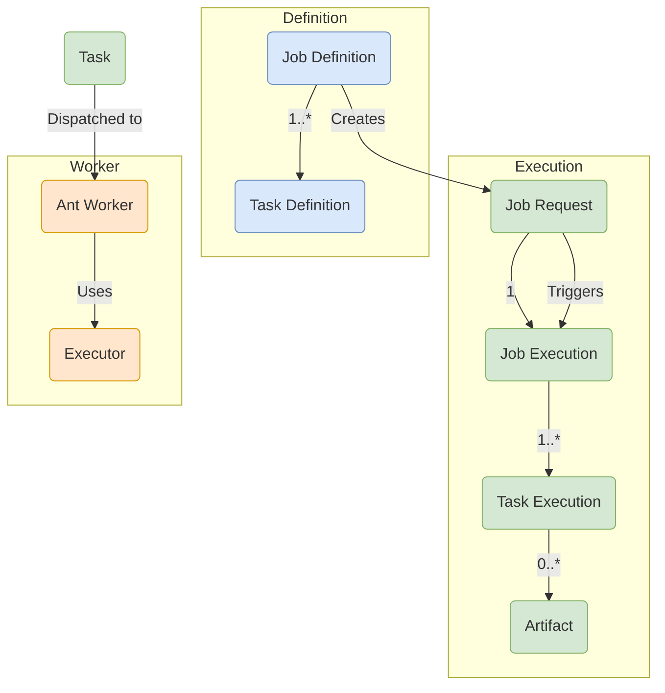

# Core Concepts

Understanding the key concepts in Formicary is essential for effectively defining and managing your workflows. This document explains the primary objects and their relationships within the system.

### Job & Task Definitions

-   **Job Definition:** The blueprint for a workflow. It is a versioned YAML file that contains a `job_type`, a list of task definitions, and the relationships between them. It defines *what* can be done.

-   **Task Definition:** A single unit of work within a Job Definition. It specifies the `task_type` (its name), the `method` (which executor to use), the script to run, its dependencies, and how to proceed upon completion or failure (`on_completed`, `on_exit_code`).

### Job & Task Execution

-   **Job Request:** An instantiation of a `Job Definition`. It represents a user's intent to run a job, along with any parameters for that specific run. When you submit a job, you create a Job Request, which initially has a `PENDING` status.

-   **Job Execution:** The actual runtime instance of a Job Request. A Job Execution is created by the scheduler when resources become available. It tracks the overall state (`EXECUTING`, `COMPLETED`, `FAILED`) and contains the execution records for all its tasks.

-   **Task Execution:** The runtime instance of a `Task Definition`. It records the start/end times, exit code, logs, and any artifacts produced by a single task run.

### Workers & Executors

-   **Ant Worker:** A follower process that executes tasks. Ants are horizontally scalable and register with the Queen to receive work.

-   **Executor:** A module within an Ant that provides the logic for a specific execution environment. The `method` field in a Task Definition determines which executor is used. For example, a method of `DOCKER` will use the Docker executor.

-   **Tags:** Arbitrary labels assigned to Ant workers. This allows you to route tasks to specific workers. For example, you could have Ants with a `gpu-enabled` tag and direct machine learning tasks to them.

### Data & Flow Control

-   **Artifacts:** The output of a task, such as compiled binaries, test reports, or processed data files. Artifacts are stored in an S3-compatible object store and can be passed between tasks as dependencies.

-   **Cache:** A special type of artifact used to persist directories (like `node_modules` or `.m2/repository`) between job runs to speed up dependency installation.

-   **Variables:** Key-value pairs that can be defined at the job or task level. They are available within the task's script via Go templating, allowing for dynamic and reusable job definitions.

-   **Workflow (DAG):** The execution flow is a Directed Acyclic Graph (DAG) defined by the `on_completed`, `on_failed`, and `on_exit_code` properties within your Task Definitions. This allows you to build complex workflows with conditional paths.

