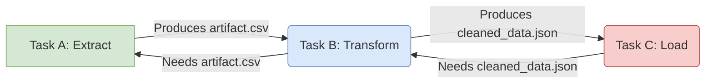

# Tutorials: Building Data Pipelines

Formicary's architecture is perfectly suited for creating robust data processing pipelines. By chaining tasks together and passing data between them using artifacts, you can implement complex ETL (Extract, Transform, Load) workflows and other batch processing jobs.

This approach follows the classic **Pipes and Filters** architectural pattern, where each task acts as a "filter" that processes data and passes its output to the next stage through a "pipe" (the artifact store).

## The Core Pattern: Dependencies and Artifacts

The key to building pipelines in Formicary is the interplay between `artifacts` and `dependencies`.

1.  An **upstream** task (e.g., `extract`) performs an action and saves its output files as `artifacts`.
2.  A **downstream** task (e.g., `transform`) declares its dependency on the upstream task using the `dependencies` key.
3.  Before the downstream task's script runs, Formicary automatically downloads and unpacks the artifacts from all its dependencies into its working directory.

This creates a reliable, explicit data flow between the stages of your pipeline.



## Tutorial: An ETL Pipeline for Stock Data

Let's build a three-stage pipeline that:
1.  **Extracts** stock market data from an API.
2.  **Transforms** the raw JSON data to isolate specific fields.
3.  **Loads** the transformed data and calculates an average.

### Full Job Definition

```yaml:etl-stock-job.yaml
job_type: etl-stock-job
description: A simple ETL pipeline to calculate average stock price.
max_concurrency: 1
tasks:
  - task_type: extract
    method: KUBERNETES
    container:
      image: python:3.8-buster
    before_script:
      - pip install yfinance --upgrade --no-cache-dir
    script:
      - python -c 'import yfinance as yf;import json;stock = yf.Ticker("{{.Symbol}}");j = json.dumps(stock.info);print(j);' > stock.json
    artifacts:
      paths:
        - stock.json
    on_completed: transform

  - task_type: transform
    method: KUBERNETES
    container:
      image: alpine
    dependencies:
      - extract
    before_script:
      - apk --update add jq
    script:
      - cat stock.json | jq '.ask,.bid' > askbid.txt
    artifacts:
      paths:
        - askbid.txt
    on_completed: load

  - task_type: load
    method: KUBERNETES
    dependencies:
      - transform
    container:
      image: alpine
    script:
      - awk '{ sum += $1; n++ } END { if (n > 0) print sum / n; }' askbid.txt > avg.txt
    artifacts:
      paths:
        - avg.txt
```

### Stage Breakdown

#### 1. The `extract` Task
This task uses a Python container to fetch data.
-   **`before_script`**: Installs the `yfinance` library.
-   **`script`**: A one-liner Python script that takes a `Symbol` parameter (e.g., "MSFT"), fetches the data, and saves it as `stock.json`.
-   **`artifacts`**: Declares that `stock.json` is the output of this stage.
-   **`on_completed`**: Specifies that the `transform` task should run next.

#### 2. The `transform` Task
This task uses the lightweight `alpine` image and the powerful `jq` tool to process the JSON.
-   **`dependencies: [extract]`**: This is critical. It tells Formicary to download `stock.json` before this task starts.
-   **`before_script`**: Installs `jq`.
-   **`script`**: Reads the `stock.json` artifact and uses `jq` to extract just the `ask` and `bid` prices into a new file, `askbid.txt`.
-   **`artifacts`**: Declares `askbid.txt` as its output.

#### 3. The `load` Task
This final task performs a simple calculation.
-   **`dependencies: [transform]`**: Makes `askbid.txt` available.
-   **`script`**: Uses `awk` to read the numbers from `askbid.txt` and calculate their average, saving the result to `avg.txt`.
-   **`artifacts`**: Saves the final result, `avg.txt`.

### Running the Pipeline

1.  **Upload the definition** as `etl-stock-job.yaml`.
2.  **Submit a request**, passing the required `Symbol` parameter.
    ```bash
    curl -H "Authorization: Bearer <API_TOKEN>" \
         -H "Content-Type: application/json" \
         -d '{
               "job_type": "etl-stock-job",
               "params": { "Symbol": "MSFT" }
             }' \
         http://localhost:7777/api/jobs/requests
    ```

You can now monitor the three stages executing in sequence on the dashboard and download the final `avg.txt` artifact.
