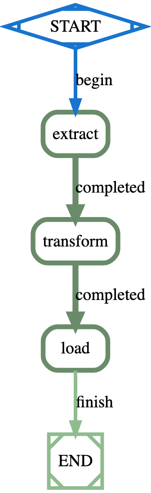

## ETL Examples

### Stock Calculation Job

Following example defines job-definition for calculating average stock price:



```yaml
job_type: etl-stock-job
description: Simple ETL Stock pipeline example
max_concurrency: 1
tasks:
  - task_type: extract
    method: KUBERNETES
    container:
      image: python:3.8-buster
    before_script:
      - pip install yfinance --upgrade --no-cache-dir
    script:
      - python -c 'import yfinance as yf;import json;stock = yf.Ticker("{{.Symbol}}");j = json.dumps(stock.info);print(j);' > stock.json
    artifacts:
      paths:
        - stock.json
    on_completed: transform
  - task_type: transform
    method: KUBERNETES
    tags:
      - builder
    container:
      image: alpine
    dependencies:
      - extract
    before_script:
      - apk --update add jq && rm -rf /var/lib/apt/lists/* && rm /var/cache/apk/*
    script:
      - jq '.ask,.bid' > askbid.txt
    artifacts:
      paths:
        - askbid.txt
    on_completed: load
  - task_type: load
    method: KUBERNETES
    dependencies:
      - transform
    script:
      - awk '{ sum += $1; n++ } END { if (n > 0) print sum / n; }' askbid.txt > avg.txt
    after_script:
      - ls -l
    container:
      image: alpine
    artifacts:
      paths:
        - avg.txt
```

### Simple JSON Sum

Following example defines job-definition for calculating sum from JSON object:

```yaml
job_type: etl-sum-job
description: Simple ETL example
tasks:
# A simple extract task that defines a JSON string
- task_type: extract
  container:
    image: alpine
  variables:
    data_string: '{"1001": 301.27, "1002": 433.21, "1003": 502.22}'
  script:
    - >
      echo '{{.data_string | Unescape}}' > order_data_dict.json
    - ls -ltr
  artifacts:
    paths:
      - order_data_dict.json
  on_completed: transform
# A simple transform task that calculates sum from a JSON string
- task_type: transform
  container:
    image: python:3.8-buster
  dependencies:
    - extract
  script:
    - cat order_data_dict.json
    - python -c "import json;f = open('order_data_dict.json');data = json.load(f);sum = sum(data.values());print(sum);f.close()" > sum.txt
  artifacts:
    paths:
      - sum.txt
  on_completed: load
# A simple transform task that print (or save) JSON string
- task_type: load
  dependencies:
    - transform
  script:
    - cat sum.txt
  container:
    image: alpine
```

#### Job Type

The `job_type` defines type of the job, which is `etl-stock-job` or `etl-sum-job` in above examples.

#### Tasks

The tasks section define the DAG or workflow of the build job where each specifies details for each build step such as:

##### Task Type

The `task_type` defines name of the task, e.g.

```yaml
- task_type: extract 
```

##### Task method

The `method` defines executor type such as KUBENETES, DOCKER, SHELL, etc:

```yaml
  method: KUBERNETES
```

##### Docker Image

The `image` tag within `container` defines docker-image to use for execution commands, which is `python:3.8-buster` for
the python support, e.g.

```yaml
  container:
    image: python:3.8-buster
```

##### Script Commands

The `script` defines an array of shell commands that are executed inside container, e.g.,

```yaml
  script:
    - python -c 'import yfinance as yf;import json;stock = yf.Ticker("{{.Symbol}}");j = json.dumps(stock.info);print(j);' > stock.json
```

In above example, python script is used to download stock data for a stock symbol, which will be passed as a parameter.

##### Before Script Commands

The `before_script` defines an array of shell commands that are executed before the main script, e.g. `extract`
task installs `jq` tool, .i.e.,

```yaml
  before_script:
    - apk --update add jq && rm -rf /var/lib/apt/lists/* && rm /var/cache/apk/*
```

##### After Script Commands

The `after_script` defines an array of shell commands that are executed after the main script whether the task fails or
succeeds, e.g.,

```yaml
  after_script:
    - ls -l
```

##### Artifacts

The output of commands can be stored in an artifact-store so that you can easily download it, e.g.
`extract` task will store the output stock data as an artifact, e.g.,

```yaml
  artifacts:
    paths:
      - stock.json
```

##### Next Task

The next task can be defined using `on_completed`, `on_failed` or `on_exit`, e.g.

```yaml
on_completed: transform
```

Above task defines `transform` task as the next task to execute when it completes successfully. The last task won't use
this property, so the job will end.

##### Dependent Artifacts

The artifacts from one task can be used by other tasks, e.g. `transform` task is listing `extract` tasks under
`dependencies` so all artifacts from those tasks are automatically made available for the task.

```yaml
- task_type: load
  dependencies:
    - transform
```

### Uploading Job Definition

You can store the job configuration in a `YAML` file and then upload using dashboard or API such as:

```yaml
curl -v -H "Authorization: Bearer $TOKEN" \
  -H "Content-Type: application/yaml" \
  --data-binary @etl-stock-job.yaml $SERVER/api/jobs/definitions
```

You will need to create an API token to access the API using [Authentication](apidocs.md#Authentication) to the API
sever defined by $SERVER environment variable passing token via $TOKEN environment variable.

### Submitting Job Request Manually

You can then submit the job as follows:

```yaml
curl -v -H "Authorization: Bearer $TOKEN" \
  -H "Content-Type: application/json" \
  --data '{"job_type": "etl-stock-job", "params": { "Symbol": "MSFT" } }' $SERVER/jobs/requests
```

The above example kicks off `etl-stock-job` job with `"Symbol": "MSFT"` parameters for the stock symbol.
