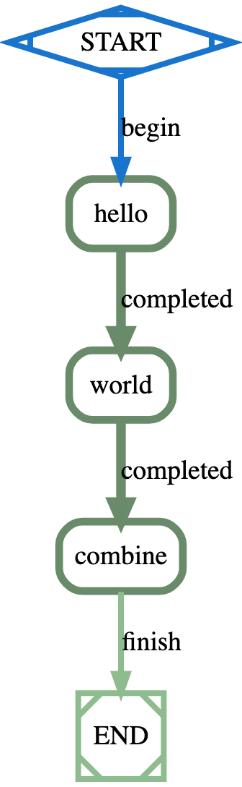

## Getting Started

### Job Definition
The formicary can be used to execute batch jobs, workflows or CI/CD pipelines, where the 
execution specifications are defined in a job configuration. A job defines directed acyclic 
graph (DAG) of tasks for the order of execution, which can also be considered as 
a workflow for the execution path of tasks. The task defines a unit of work, which can be executing using
DOCKER, KUBERNETES, HTTP, SHELL, MESSAGING or other executors.

*Note:* The formicary uses a yaml based job-definition to specify the metadata and workflow of the job and an instance
of job-definition called `job-execution` is created upon submitting job-request.

### Job Configuration
Following is an example of ``hello-world`` job configuration that defines three tasks:



```yaml
job_type: hello-world
description: A hello world example
max_concurrency: 1
tasks:
- task_type: hello
  container:
    image: alpine
  script:
    - date
    - echo "hello " > hello.txt
  artifacts:
    paths:
      - hello.txt
  on_completed: world
- task_type: world
  container:
    image: alpine
  script:
    - date
    - echo "{{.Target}}" > world.txt
  artifacts:
    paths:
      - world.txt
  on_completed: combine
- task_type: combine
  container:
    image: alpine
  dependencies:
    - hello
    - world
  script:
    - date
    - cat hello.txt world.txt > output.txt
  artifacts:
    paths:
      - output.txt
job_variables:
    Target: world
```

#### Job Type
The `job_type` defines type of the job that will be used when submitting a job for new execution.
```yaml
job_type: hello-world
```

#### Description
You can optionally add `description` of the job, e.g.
```yaml
description: A hello world example
```

#### Concurrency
You can optionally add `max_concurrency` to limit maximum instances of the job that can be executed concurrently, e.g.
```yaml
max_concurrency: 1
```

#### Tasks
The tasks define the DAG or workflow of the job where each specifies details of how the task will run and what to do upon completion of the task such as:

##### Task Type
The `task_type` defines name of the task, e.g.
```yaml
- task_type: hello
```

##### Task method
The `method` defines executor type such as KUBERNETES, DOCKER, SHELL, etc:
```yaml
  method: KUBERNETES
```

##### Docker Image
The `image` tag within `container` defines docker-image to use for execution commands, e.g.
```yaml
  container:
    image: alpine
```

##### Script Commands
The `script` defines an array of commands that are executed inside container, e.g.
```yaml
  script:
    - date
    - echo "hello " > hello.txt
```
Above example will execute `date` command first and then execute `echo` command where the output is stored in a text file.

##### Artifacts
The output of commands can be stored in an artifact-store so that you can easily download it, e.g.
```yaml
  artifacts:
    paths:
      - hello.txt
```
Above definition defines `hello.txt` in `paths` under `artifacts`, which will be uploaded to the artifact-store.

The artifacts from one task can be used by other tasks, e.g. `combine` task is listing `hello` and `world` tasks under 
`dependencies` so all artifacts from those tasks are automatically made available for the task.
```yaml
- task_type: combine
  dependencies:
    - hello
    - world
```

##### Next Task
The next task can be defined using `on_completed`, `on_failed` or `on_exit`, e.g.
```yaml
on_completed: world
```
Above task defines `world` task as the next task to execute when it completes successfully. The last task won't use 
this property, so the job will end.

##### Job Parameters and Variables
A job can use a template variables in the job configuration that can be initialized using variables in the configuration or 
can be passed with job request, e.g.
```yaml
    - echo "{{.Target}}" > world.txt
```

```yaml
job_variables:
    Target: world
```
The job configuration uses GO templates for initializing variables that can be defined under `job_variables`.

### Uploading Job Definition
You can store the job configuration in a `YAML` file and then upload using dashboard UI or API such as:

```yaml
curl -v -H "Authorization: Bearer $TOKEN" \
    -H "Content-Type: application/yaml" \
    --data-binary hello-world.yaml $SERVER/api/jobs/definitions
```
You will need to create an API token to access the API using [Authentication](apidocs.md#Authentication) to
the API sever defined by $SERVER environment variable passing token via $TOKEN environment variable.

### Submitting Job Request Manually
You can then submit the job as follows:

```yaml
curl -v -H "Authorization: Bearer $TOKEN" \
    -H "Content-Type: application/json" \
    --data '{"job_type": "hello-world", "params": {"Target": "bob"}}' $SERVER/api/jobs/requests
```
The above example kicks off `hello-world` job and passes `bob` as parameter to replace `Target` variable in the job definition.

### Scheduling Job in future
See [Job Scheduling](howto.md#Scheduling_Future) for submitting a job at scheduled.

### Scheduling Job Request with regular interval
See [Regular Scheduling](howto.md#Cron) for submitting a job at scheduled interval.

### Filtering Job Request
See [Job Filtering](definition_options.md#filter) for filtering scheduled job.
