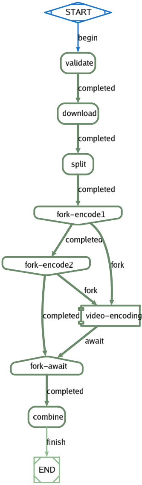

## Parallel Pipelines with parent/child
See [Simple Pipeline](pipelines.md) for an example of building a basic pipeline. You can then extend
these pipelines with multiple jobs that can be spawned from the parent job that are executed concurrently 
in background.

For example, the video-encoding job can parallelize encoding of videos by spawning multiple jobs as follows:



#### Job Configuration
Following example defines job-definition with a simple pipeline:
```yaml
job_type: parallel-video-encoding
description: Parallel example of video encoding
max_concurrency: 1
tasks:
- task_type: validate
  script:
    - echo request must have URL {{.URL}}, InputEncoding {{.InputEncoding}} and OutputEncoding {{.OutputEncoding}}
  container:
    image: alpine
  on_completed: download
- task_type: download
  container:
    image: python:3.8-buster
  script:
    - curl -o video_file.{{.InputEncoding}} {{.URL}}
  artifacts:
    paths:
      - video_file.{{.InputEncoding}}
  on_completed: split
- task_type: split
  container:
    image: alpine
  script:
    - ls -l
    - cp video_file.{{.InputEncoding}} video_file.{{.InputEncoding}}.1
    - cp video_file.{{.InputEncoding}} video_file.{{.InputEncoding}}.2
    - cp video_file.{{.InputEncoding}} video_file.{{.InputEncoding}}.3
  dependencies:
    - download
  artifacts:
    paths:
      - video_file.{{.InputEncoding}}.1
      - video_file.{{.InputEncoding}}.2
  on_completed: fork-encode1
- task_type: fork-encode1
  method: FORK_JOB
  fork_job_type: video-encoding
  fork_job_version: 1.0-dev
  variables:
    URL: {{.split_ArtifactURL_1}}
    InputEncoding: {{.InputEncoding}}
    OutputEncoding: {{.OutputEncoding}}
  on_completed: fork-encode2
- task_type: fork-encode2
  method: FORK_JOB
  fork_job_type: video-encoding
  fork_job_version: 1.0-dev
  variables:
    URL: {{.split_ArtifactURL_2}}
    InputEncoding: {{.InputEncoding}}
    OutputEncoding: {{.OutputEncoding}}
  on_completed: fork-await
- task_type: fork-await
  method: AWAIT_FORKED_JOB
  on_completed: combine
  await_forked_tasks:
    - fork-encode1
    - fork-encode2
- task_type: combine
  container:
    image: alpine
  script:
    - ls -l
    - cat video_file.{{.InputEncoding}}* >  video_file.{{.OutputEncoding}}
  dependencies:
    - fork-await
  artifacts:
    paths:
      - video_file.{{.OutputEncoding}}
```

Above definition defines `validate` and `download` tasks as before but `split` task splits video file into smaller
video files that can be encoded in parallel. It then defines `fork-encode1` and `fork-encode2` tasks to fork child `video-encoding`
job that was defined earlier and then wait for their completion in `fork-await` task. Finally, it combines output
files into a single file.

##### Fork Jobs
The task `method` with value of `FORK_JOB` spawns a child job where `fork_job_type` defines type of the job, `fork_job_version` defines version of the job,
and `variables` define the input parameters to the job:
```yaml
- task_type: fork-encode1
  method: FORK_JOB
  fork_job_type: video-encoding
  fork_job_version: 1.0-dev
  variables:
    URL: {{.split_ArtifactURL_1}}
    InputEncoding: {{.InputEncoding}}
    OutputEncoding: {{.OutputEncoding}}
```

##### Waiting for completion of child jobs
The task `method` with value of `AWAIT_FORKED_JOB` waits for completion of child jobs where `await_forked_tasks` defines
list of jobs to wait, e.g.
```yaml
- task_type: fork-await
  method: AWAIT_FORKED_JOB
  on_completed: combine
  await_forked_tasks:
    - fork-encode1
    - fork-encode2
```

*Note*: All artifacts from the child job are automatically made available to the parent job.


### Uploading Job Definition
You can store the job configuration in a `YAML` file and then upload using dashboard UI or API such as:

```yaml
curl -v -H "Authorization: Bearer $TOKEN" \
    -H "Content-Type: application/yaml" \
    --data-binary @parallel-video-encoding.yaml $SERVER/api/jobs/definitions
```
### Submitting Job Request Manually
You can then submit the job as follows:

```yaml
curl -v -H "Authorization: Bearer $TOKEN" \
    -H "Content-Type: application/json" \
    --data '{"job_type": "parallel-video-encoding", "params": {"InputEncoding": "MP4", "OutputEncoding": "WebM", "URL": "https://github.com"}}' $SERVER/api/jobs/requests
```
The above example kicks off `video-encoding` job and passes `URL`, `InputEncoding`, and `OutputEncoding` as parameters.
