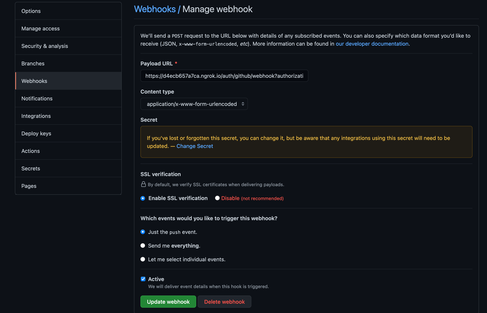

## How-to Guides

### Scheduling

Once a job configuration is defined and uploaded, you can submit a new job manually as follows:

```yaml
curl -v -H "Authorization:
  Bearer $TOKEN" -H "Content-Type:
    application/json" --data '{"job_type": "hello_world", "params": { "Target": "bob" } }' $SERVER/api/jobs/requests
```

The above example will kick off `hello_world` immediately based on available resources.

### Scheduling_Future

You can submit a job at scheduled time by adding `scheduled_at` parameter as follows:

```yaml
curl -v -H "Authorization:
  Bearer $TOKEN" -H "Content-Type:
    application/json" --data '{"job_type": "hello_world", "scheduled_at": "2025-06-15T00:00:00.0-00:00", "params": { "Target": "bob" } }' $SERVER/api/jobs/requests
```

The above example will kick off `hello_world` job based on `scheduled_at` time in the future, however the job will be
immediately scheduled if the `scheduled_at` is in the past.

### Cron

See [Job Filtering](definition_options.md#cron_trigger) for scheduling job at a regular interval using cron syntax.

### Job-Filtering

See [Job Filtering](definition_options.md#filter) for filtering scheduled job.

### Configs

In addition to specifying variables in the job-configuration and pass as request parameters, you can store common or
sensitive configuration separately, which can be references within the job definition. These configurations can be
updated using dashboard UI or API, e.g., following example stores organization specific configurations:

```bash
curl -v -H "Authorization: Bearer $TOKEN" -H "Content-Type: application/yaml" \
  $SERVER/api/orgs/<org-id>/configs -d '{"Name": "MyToken", "Value": "TokenValue"}'
```

Similarly, following example adds configuration for a specific job:

```bash
curl -v -H "Authorization: Bearer $TOKEN" -H "Content-Type: application/yaml" \
  $SERVER/api/jobs/definitions/<job-id>/configs -d '{"Name": "MyToken", "Value": "TokenValue"}'
```

### Caching

Formicary also provides caching for directories that store 3rd party dependencies, e.g.,
following example shows how all node_modules will be cached:

```yaml
   cache:
     key_paths:
       - go.mod
     paths:
       - vendor
```

In above example `vendor` folder will be cached between the runs of the job and the cache key will be based on contents of
`go.mod`.

You can also specify a `key` instead of file based `key_paths`, e.g.

```yaml
   cache:
     key: {{.CommitID}}
     paths:
       - vendor
```

This key allows sharing cache between tasks, e.g., `release` tag is reusing this cache with the same key:

```yaml
- task_type: release
  method: KUBERNETES
  script:
    - ls -al .cache/pip venv
  cache:
    key: cache-key
    paths:
      - .cache/pip
      - venv
```

### Repositories_Access_Tokens

The formicary supports encrypted storage for tokens and password that can be used to access the source code
repositories. For example, if you are using GitHub you can create
[personal access token](https://docs.github.com/en/github/authenticating-to-github/keeping-your-account-and-data-secure/creating-a-personal-access-token)
and then checkout code, e.g.,

```bash
git clone https://<your-token>@github.com/<yourid>/<your-project>.git
```

Alternatively, you can use username/password such as:

```bash
git clone https://<username>:<password>@github.com/<yourid>/<your-project>.git
```

Or you can store ssh keys in job-definition / organization configs for accessing the git repositories:

```bash
git clone https://<username>:<password>@github.com/<yourid>/<your-project>.git
```

### Webhooks

You can submit jobs by creating GitHub Webhook, e.g.,


First set `Payload URL` to `$SERVER/auth/github/webhook?authorization=<api-token&job=<job-type>`, where the
`api-token` can be generated from the dashboard-UI and `job` points to the job-type that you have configured. Next, set
a secret for the payload and add a job configuration for `GithubWebhookSecret`, e.g.

```bash
curl -v -H "Authorization: Bearer $TOKEN" \
  -H "Content-Type: application/yaml" \
  $SERVER/api/jobs/definitions/<job-type>/configs -d '{"Name": "GithubWebhookSecret", "Value": "my-secret", "Secret": true}'
```

Anytime, when someone checks in a code, the webhook will trigger the job to execute, and the job receives following
parameters:

- GitBranch
- GitCommitAuthor
- GitCommitID
- GitCommitMessage
- GitRepository
- GithubRepositoryURL

Above parameters can be used to check out the branch or commit and then execute CI/CD, e.g.

```yaml
- task_type: build
  host_network: true
  method: KUBERNETES
  working_dir: /sample
  container:
    image: node:16-buster
  before_script:
    - git clone https://{{.GithubToken}}@github.com/bhatti/node-crud.git .
    - git checkout -t origin/{{.GitBranch}} || git checkout {{.GitBranch}}
  script:
    - echo branch {{.GitBranch}}, Commit {{.GitCommitID}}
    - npm install
```

### PostCommit

You can also submit jobs by creating Git post-commit hooks by creating a `post-commit` file under `.git/hooks` such as:

```bash
#!/bin/sh
export SHORT_COMMIT=`git describe --always --long --dirty`
export COMMIT=`git rev-parse --verify HEAD`
export BRANCH=`git rev-parse --symbolic-full-name --abbrev-ref HEAD`
export AUTHOR=`git log -1 --pretty=format:'%an'`
export AUTHOR_EMAIL=`git log -1 --pretty=format:'%ae'`
export COMMIT_MESSAGE=`git log -1 --pretty=%B`

curl -v -H "Authorization: Bearer $FRM_TOKEN" \
  -H "Content-Type: application/yaml" \
    --data-binary @node_build.yaml $FRM_SERVER/api/jobs/definitions || echo 'failed to upload ci job configuration for node_build'
curl -v -H "Authorization: Bearer $FRM_TOKEN" \
  -H "Content-Type: application/json" \
    --data "{\"job_type\": \"node_build\", \"params\": {\"GitCommitID\": \"$COMMIT\", \"GitBranch\": \"$BRANCH\", \"GitCommitMessage\": \"$COMMIT_MESSAGE\"}}" $FRM_SERVER/api/jobs/requests || echo 'failed to submit ci job configuration for node_build'
```

You can store the job configuration in your home folder and then use above script to submit the job request. Above
script assumes the `$FRM_SERVER` points to formicary-server and `$FRM_TOKEN` points to the API token, it then uploads
the job configuration and then submits the job passing the commit and branch as parameters. You can then refer to those
parameters from the job configuration, e.g.

```yaml
- task_type: build
  host_network: true
  method: KUBERNETES
  working_dir: /sample
  container:
    image: node:16-buster
  before_script:
    - git clone https://{{.GithubToken}}@github.com/bhatti/node-crud.git .
    - git checkout -t origin/{{.GitBranch}} || git checkout {{.GitBranch}}
  script:
    - echo branch {{.GitBranch}}, Commit {{.GitCommitID}}
    - npm install
  after_script:
    - ls -l
```

Anytime, when someone checks in a code, the webhook will trigger the job for execution, and the job will receive following
parameters:

- GitBranch
- GitCommit

### Docker in Docker (dind)

See [Building Docker images](dind.md) for building images using docker in docker.

### Scanning GO source (https://github.com/securego/gosec)

See [Scanning Golang using gosec](gosec-scan.md) for scanning GO source code.

### Scanning containers for security

See [Scanning containers using Trivy](trivy-scan.md) for scanning containers for security.

### Advanced Kubernetes

See [Advanced Kubernetes](advanced_k8.md) for using advanced kubernetes configs.

